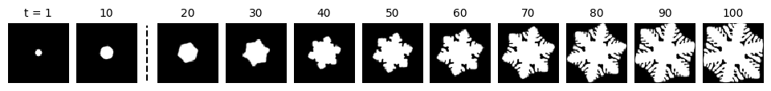
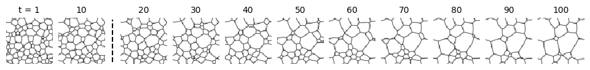
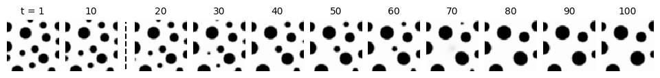
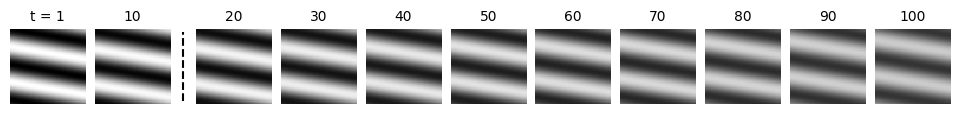
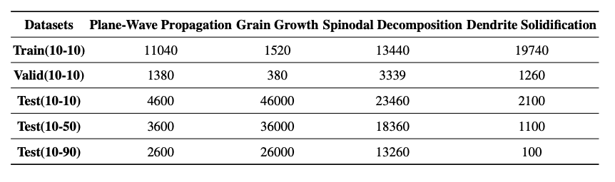

## Introduction
Existing deep learning (DL) models for microstructure evolution (MicroEvo) lack standardized benchmarks, often overlooking physical fidelity and long-term error propagation. To bridge this gap, we developed ​MicroEvoEval, the first benchmark system for image-based MicroEvo prediction. Our framework evaluates 14 DL architectures (including domain-specific and general-purpose models) across four tasks, combining ​short- and long-term numerical accuracy metrics​ and our designed physical metrics. Unlike prior studies, we prioritize both numerical accuracy and computational efficiency while analyzing temporal error dynamics. This work establishes a systematic evaluation paradigm for optimizing DL models in materials design.

In this code, We have developed a framework for four microstructure evolution tasks to evaluate the accuracy and efficiency of different models for microstructure evolution tasks, and incorporated physical metrics to assess the physical property retention of the models.

## Tasks & Datasets
### Tasks
MicroEvoEval is built upon these four representative tasks spanning a range of physical phenomena.

`Plane wave propagation` The first task is a simple yet physically relevant toy model that captures the periodic nature of microstructures.

`Grain growth` the second task focuses on grain growth, which is simulated using a multi-order-parameter phase-field model.

`Spinodal decomposition` The third task involves spinodal decomposition, a spontaneous phase separation process in binary mixtures. 

`Dendrite Solidification` The fourth task models dendritic solidification with complex physical phenomena.

To evaluate the performance of different models on the above four microstructure evolution tasks, we designed two distinct evaluation methods. One of them is short-term prediction. We set the short-term prediction to input 10 frames and predict an output of 10 frames. The other one is long-term prediction. We set the long-term prediction to input 10 frames and predict an output of 50 frames, or input 10 frames and predict an output of 90 frames.

The following are some samples of test set of long-term predictions(10-90).






### Datasets
For each microstructure evolution task, we design a training set, a validation set, and three test sets respectively, corresponding to three prediction tasks of different prediction lengths(10-10,10-50,10-90) and store them as  ***NumPy*** files with extension ***'.npy'***.

Each dataset corresponds to a different number of samples, the following table shows the number of samples in each dataset for each microstructure evolution task.


For the training set, validation set or test set(10-10), there are 20 frames in every sample, while test set(10-50) has 60 frames in every sample and test set(10-90) has 100 frames in every sample.

Since the dataset is too large, here we only present the part of sampled data. We guarantee that the entire dataset will be made public after the publication of this article. The next table shows the number of samples in sampled datasets:
|Datasets|  Plane wave propagation|Grain growth|Spinodal decomposition|Dendrite Solidification|
|------|------|------|------|------|
|Test(10-10)|18|18|18|18|
|Test(10-50)|6|6|6|6|
|Test(10-90)|4|4|4|4|


**The whole dataset is available via Hugging Face**: [Link to Hugging Face](https://huggingface.co/datasets/ArcueidCroft/MicroEvoEval/tree/main)

## Supportable Models 

To ensure comprehen-sive coverage, we evaluate a total of 14 models, spanning both domain-specific microstructure prediction models and general-purpose spatiotemporal architectures, as summarized in next table with their public original github links.

**\*These links have nothing to do with the author's information of this article.\***

| Model Domain       | Model                          | Conference/Journal       | Source                                                                 |
|--------------------|--------------------------------|--------------------------|-----------------------------------------------------------------------|
| **Microstructural**| E3D-LSTM                      | Patterns 2021            | [GitHub](https://github.com/metrofun/E3D-LSTM)                       |
|                    | ConvGRU                       | Phys. Rev. Mater. 2022   | [GitHub](https://github.com/jhhuang96/ConvLSTM-PyTorch)              |
|                    | PredRNN                       | Comput. Mater. Sci. 2023 | [GitHub](https://github.com/thuml/predrnn-pytorch)                   |
|                    | ConvLSTM                      | Mater. Today Commun. 2024| [GitHub](https://github.com/jhhuang96/ConvLSTM-PyTorch)              |
|                    | VMamba                        | Comput. Mater. Sci. 2025 | [GitHub](https://github.com/ljj123-wed/VMmabaGP)                     |
| **Spatiotemporal** | PredRNN++                     | ICML 2018                | [GitHub](https://github.com/Yunbo426/predrnn-pp)                     |
|                    | MAU                           | NeurIPS 2021             | [GitHub](https://github.com/chengtan9907/OpenSTL)                    |
|                    | SimVP                         | CVPR 2022                | [GitHub](https://github.com/A4Bio/SimVP)                             |
|                    | PredRNNv2                     | TPAMI 2022               | [GitHub](https://github.com/thuml/predrnn-pytorch)                   |
|                    | TAU                           | CVPR 2023                | [GitHub](https://github.com/chengtan9907/OpenSTL)                    |
|                    | SwinLSTM                      | ICCV 2023                | [GitHub](https://github.com/SongTang-x/SwinLSTM)                     |
|                    | VMRNN                         | CVPR 2024                | [GitHub](https://github.com/yyyujintang/VMRNN-PyTorch)               |
|                    | SimVP.v2                      | TMM 2025                 | [GitHub](https://github.com/chengtan9907/OpenSTL/tree/SimVPv2)       |
|                    | PredFormer                    | Arxiv 2025               | [GitHub](https://github.com/yyyujintang/PredFormer)                  |

## Metrics
Our frameworks will automatically show the numerical accuracy metrics(MAE,MSE,SSIM,RMSE) after training or testing the models, and the physical metrics could be used after testing and saving the results to the folder.

There are two physical metrics(**L-ETAP**, **L-EAPSR**) for the four tasks we mentioned before, and our frameworks will automatically choose the corresponding metrics to evaluate the results as we showed in the following table:

| Task name | Physical metrics |
|------|------|
| Plane wave propagation| L-ETAP|
| Grain growth| L-EAPSR|
| Spinodal decomposition| L-ETAP|
|Dendrite Solidification | L-ETAP|


## Setup
The environment of microEvoEval framework may be created via **Anaconda** virtual environment and the ***environment.yml***.
```
cd models/OpenSTL
conda env create -f environment.yml
conda activate OpenSTL
python setup.py develop
pip install opencv-python
pip install pdb
```

For the prediction tasks, we recommend the following folder structure:
```
data/
 └──example_name/
     ├── checkpoints/
     ├── saved10/  #results of (10-10) task
     ├── saved50/  #results of (10-50) task
     └── saved90/  #results of (10-90) task
```

In every folder of results we recommend the following files structure:
```
savedXX/
 └──example_name/
     ├── trues.npy
     ├── preds.npy
     ├── input.npy
     └── metrics.npy

```


## Overview
-`config/:` contains the training configuration files of models in OpenSTL/VMRNN/PredFormer for the four datasets. 

-`data/Dendrite_growth:` contains the data of dendrite growth dataset.

-`data/Grain_growth:` contains the data of grain growth dataset.

-`data/Spinodal_decomposition:` contains the data of spinodal decomposition dataset.

-`data/Plane_wave_propagation:` contains the data of plane wave propagation dataset.

-`models/:` contains the models.

-`work_dirs:` contains the results and trained model.

-`MicroEvoEvalCore/data_processing.py:` code of physical metrics.

-`core/:` The core scheduling file of this framework.

## Command
We designed four abbreviations for the four datasets

`Dendrite_growth` : `den`

`Spinodal_decomposition` : `spin`

`Grain growth` : `grain`

`Plane_wave_propagation` : `plane`

Before training or testing the models, you should copy the training set, test set and validation set to the path `data/MODEL_NAME` then rename them to `train.npy`, `test.npy` and  `valid.npy` respectively or use the command `--trian_file`,`--test_file` and `--valid_file` to specify the corresponding file. Notice that the requirement environments of models 'VMamba', 'VMRNN', 'PredFormer' have conflicting library files, you need to build an independent environment  according to the instructions in the links in the table of section `Supported Models`.

### Test with numerical accuracy metrics
Use `--use_mode test` to test the model with metrics 'MSE','MAE','RMSE' and 'SSIM'.
Instance 1:

```
python main.py --use_mode test \
    --data_type den \
    --method  SimVP \
    --config_file config/simvp/SimVP_IncepU.py \
    --ex_name den_simvp_test \
    --gpu 0 \
```
Instance 2:
```
python main.py --use_mode test \
    --data_type spin \
    --method  VMRNN \
    --config_file config/VMRNN-D.py \
    --ex_name den_vmrnn_test \
    --gpu 0 \
```

### Evaluate with physical metrics
Use `--use_mode eval` to test the physical metrics of results after testing the models.

Instance:
```
python main.py --use_mode eval \
        --data_type den \
        --path_true work_dirs/model_name/trues.npy \
        --path_pred work_dirs/model_name/preds.npy
        --save_results work_dirs/model_name/
```

### Train
If you want to train the models again, use `--use_mode trian` to train the models.

Instance 1:

```
python main.py --use_mode train \
    --data_type den \
    --method  SimVP \
    --epoch 200 \
    --lr 0.0001 \
    --config_file config/simvp/SimVP_IncepU.py \
    --ex_name den_simvp_test \
    --gpu 0 \
```
Instance 2:
```
python main.py --use_mode train \
    --data_type spin \
    --method  VMRNN \
    --epoch 400 \
    --lr 0.0001 \
    --config_file config/VMRNN-D.py \
    --ex_name den_vmrnn_test \
    --gpu 0 \
```

## Acknowledgments

Our code is based on [OpenSTL](https://github.com/chengtan9907/OpenSTL).

We sincerely appreciate for their contributions.
